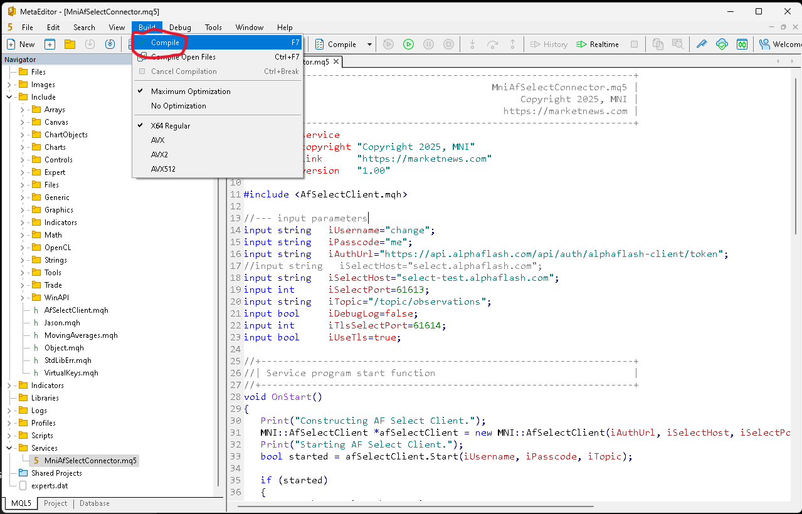
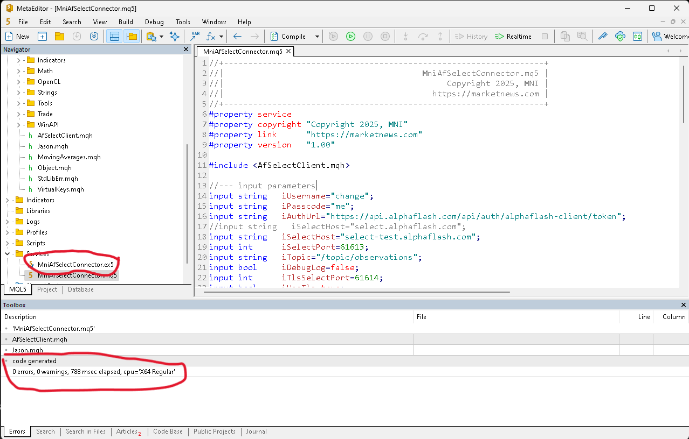
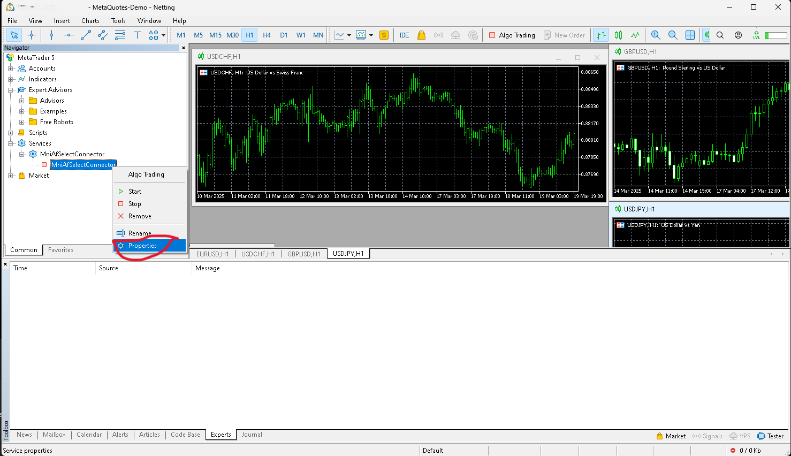
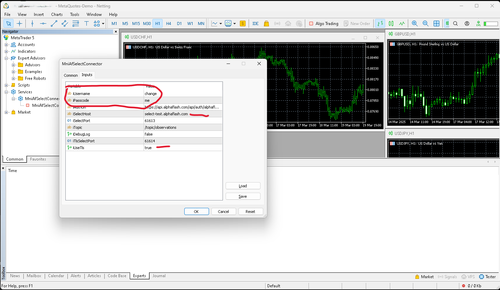
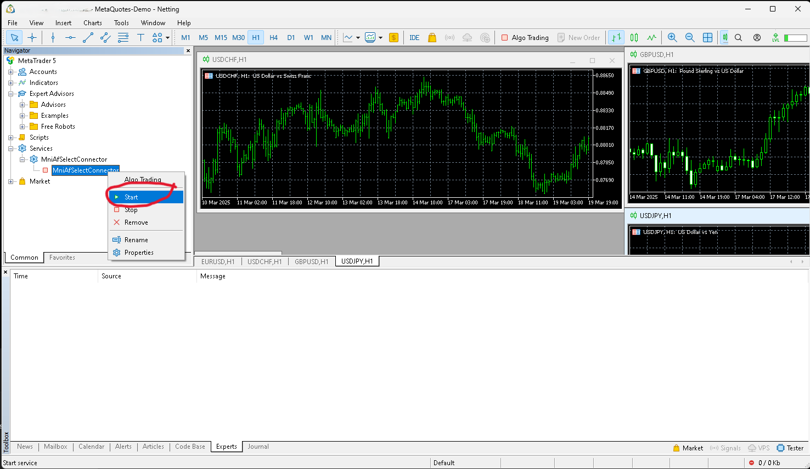
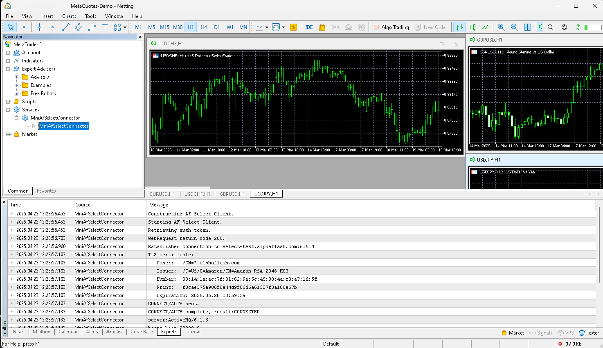

# Alpha Flash Select MetaTrader (MT5) sample.

This is a sample MT5 connector for Alpha Flash Select.

An MQL5 Service is a program that, unlike indicators, Expert Advisors and scripts, does not require to be bound to a chart to work. Like scripts, services do not handle any event except for trigger. To launch a service, its code should contain the OnStart handler function. Services do not accept any other events except Start, but they are able to send custom events to charts using EventChartCustom. Services are stored in <terminal_directory>\MQL5\Services.

## Configuration

Download and Install the components: 
* Place the include files (mqh) in the Include folder of your MetaTrader installation.
* Place the service file (mq5) in the Services folder of your MetaTrader installation.

Use MetaEditor 5 to build the Service.

### Compiling
* Open the service MniAfSelectConnector.mq5 and compile it.

### Compile output
* Note the executable MniAfSelectConnector.ex5 and compile status.

## Running the Service

Open MetaTrader 5 and start the service.

### MniAfSelectConnector Service
* Under Services expand the MniAfSelectConnector and open the properties.

### MniAfSelectConnector Service properties
* Set the iUsername/iPasscode properties.
* Set the iSelectHost property to either select-test.aplhaflash.com or select.aplhaflash.com (production)
* Set the iUseTls property to true to use TLS, false to use plain-text socket.

### MniAfSelectConnector Service startup
* Start the MniAfSelectConnector service.

### MniAfSelectConnector Service logging
* Note log entries for the MniAfSelectConnector service.

## Dependencies

| Name               | Purpose               | Links
|--------------------| --                    | --
| JAson              | JSON Serialization    | [Source](https://www.mql5.com/en/code/13663)

## Code

* [Include](Include) - This contains the AfSelectClient class that implements Select Real Time API access.
* [Services](Services) - This contains the implementation of the MniAfSelectConnector MQL5 Service.
